# 🚀 Nexora — AI Powered Career Intelligence Dashboard

Nexora is a modern AI-powered career companion app built using Flutter, Supabase, FastAPI, and Google Gemini AI.
The app helps students track their coding profiles, get personalized career analysis, and follow AI-generated placement preparation roadmaps — all through a clean, modern interface.

## 🌐 Live Demo

- **🖥️ Website:** [magenta-tarsier-e6e74d.netlify.app](https://magenta-tarsier-e6e74d.netlify.app)
- **🔧 Backend API:** [nexora-backend-h8xr.onrender.com](https://nexora-backend-h8xr.onrender.com)

> ⚠️ The backend runs on a free-tier server — the first request after a period of inactivity may take 30–60 seconds while it spins back up.

## 📱 Application Preview

<table>
  <tr>
    <td align="center"><b>Login</b></td>
    <td align="center"><b>Dashboard</b></td>
  </tr>
  <tr>
    <td>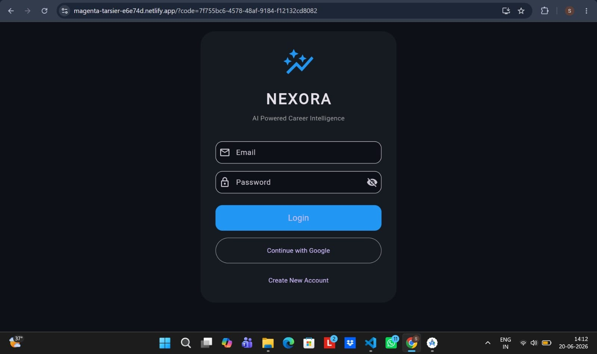</td>
    <td>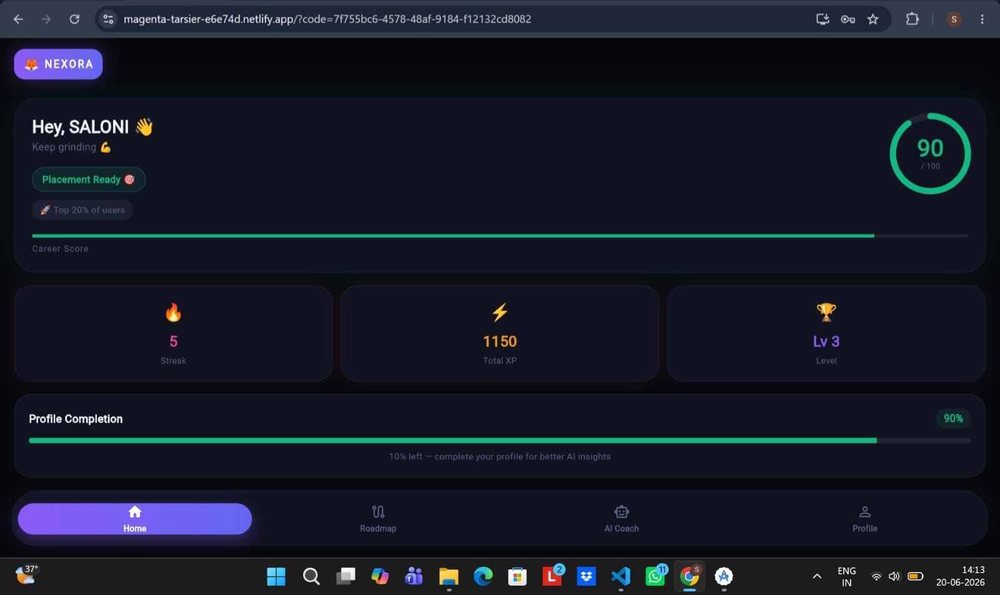</td>
  </tr>
  <tr>
    <td align="center"><b>GitHub Activity</b></td>
    <td align="center"><b>DSA Topic Strength</b></td>
  </tr>
  <tr>
    <td>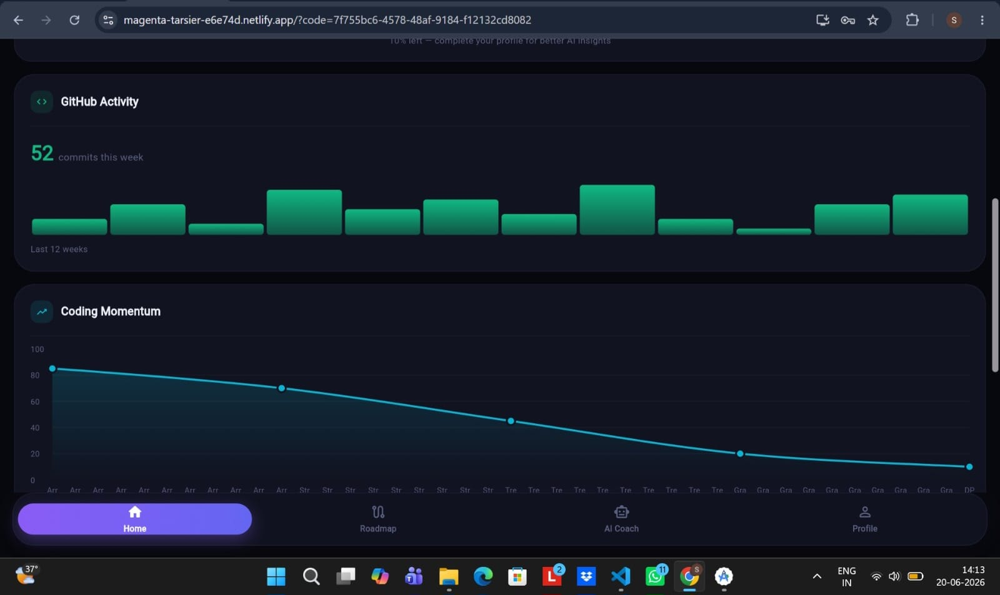</td>
    <td>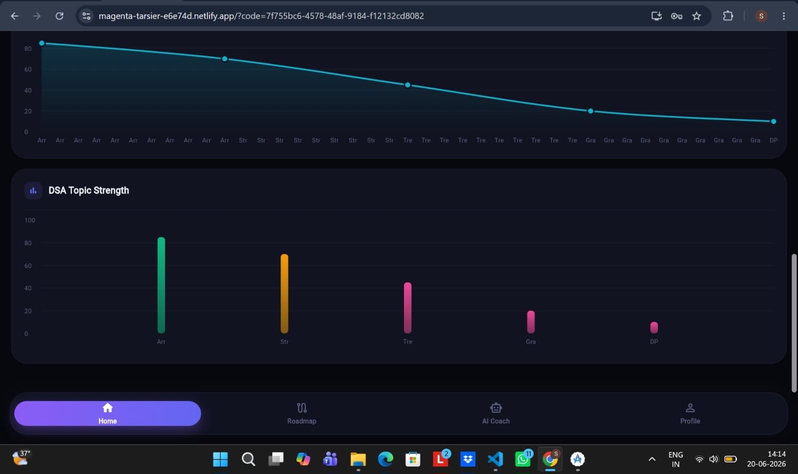</td>
  </tr>
  <tr>
    <td align="center"><b>Profile</b></td>
    <td align="center"><b>Coding Profiles</b></td>
  </tr>
  <tr>
    <td>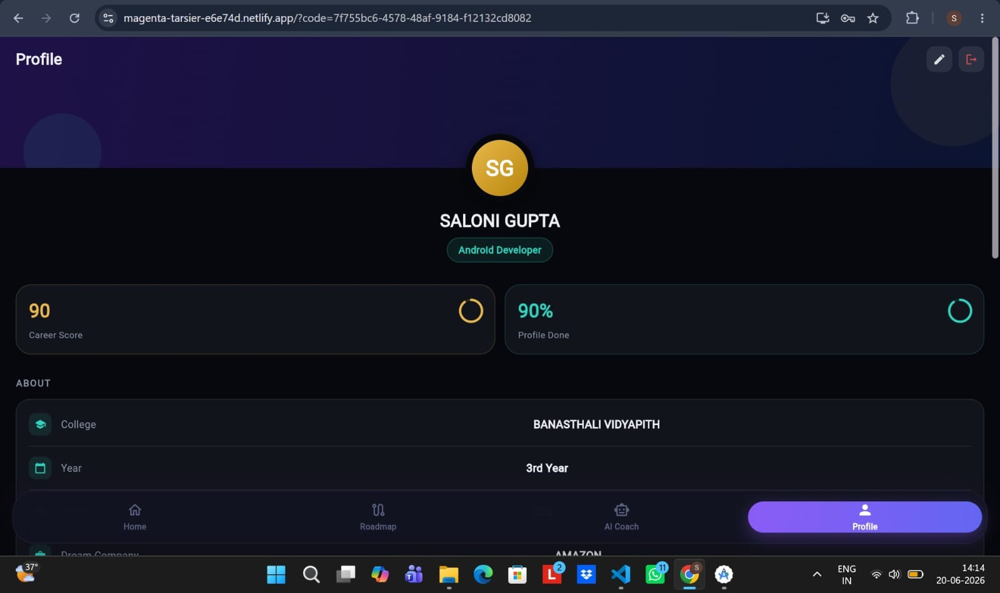</td>
    <td>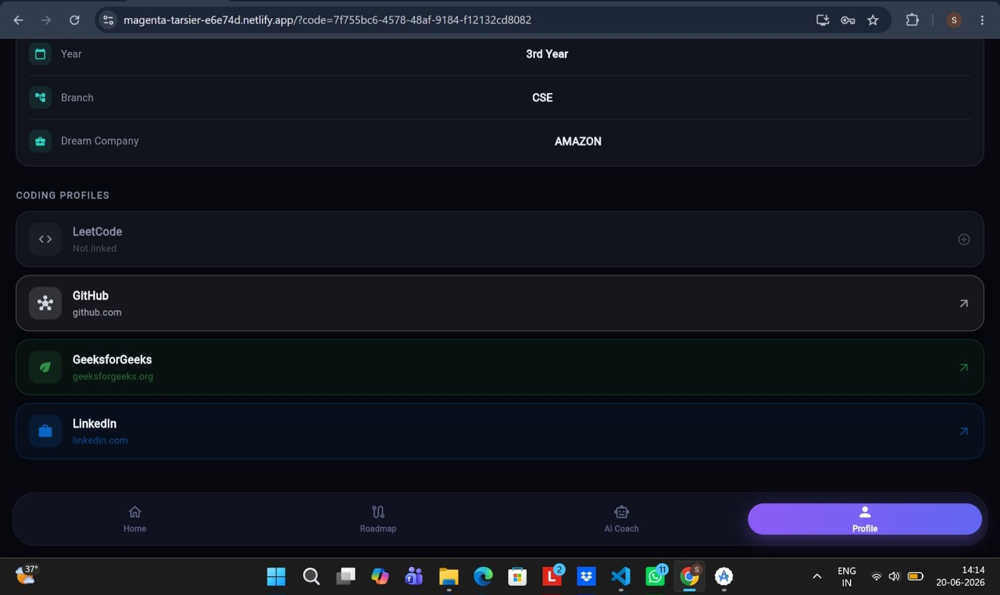</td>
  </tr>
  <tr>
    <td align="center"><b>AI Coach</b></td>
    <td align="center"><b>Strengths Analysis</b></td>
  </tr>
  <tr>
    <td>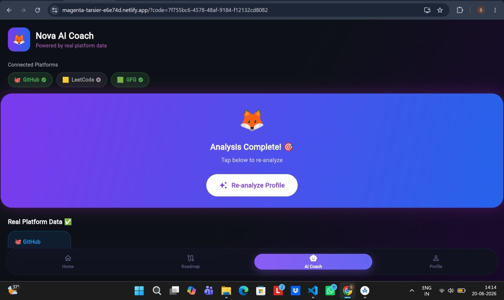</td>
    <td>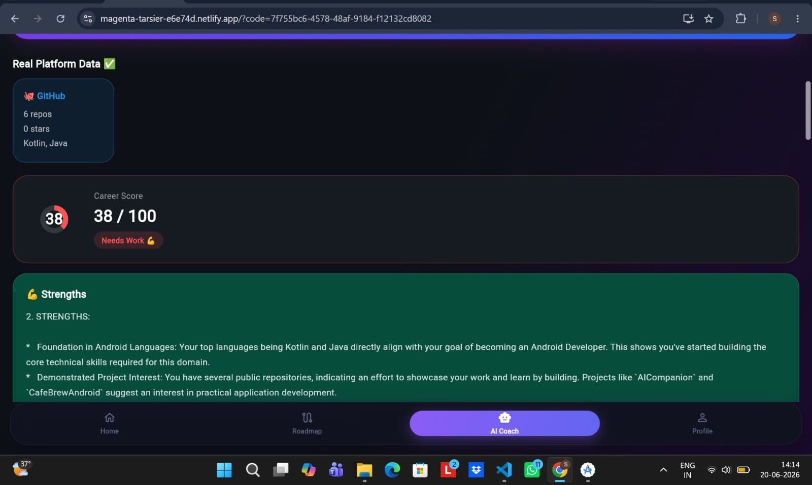</td>
  </tr>
  <tr>
    <td align="center"><b>Chat with Nova</b></td>
    <td align="center"><b>Action Plan</b></td>
  </tr>
  <tr>
    <td>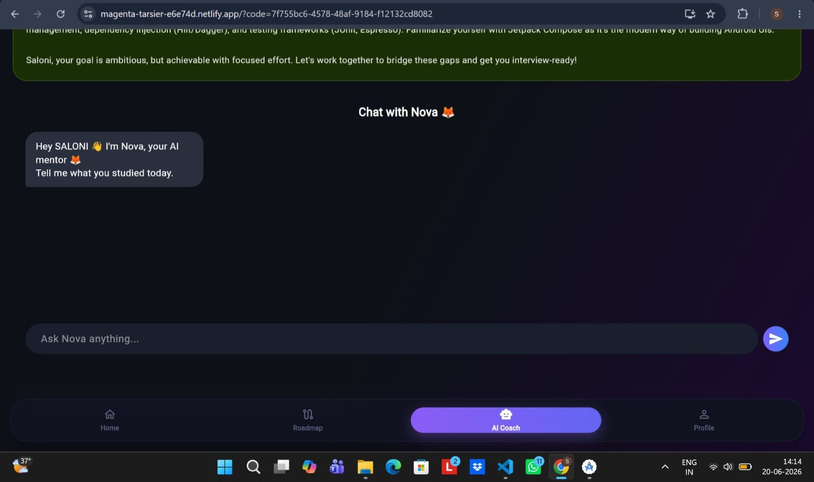</td>
    <td>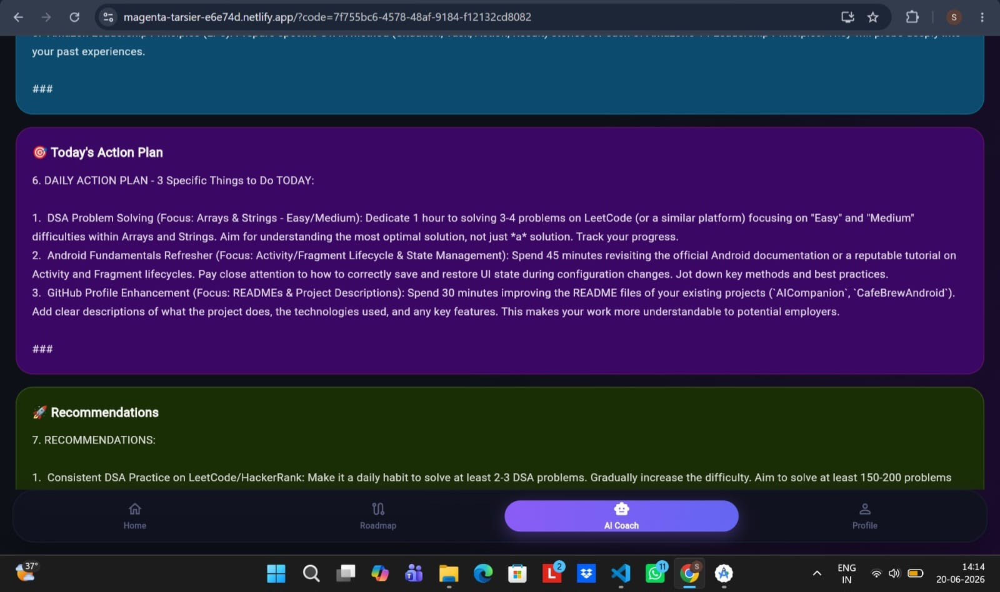</td>
  </tr>
  <tr>
    <td align="center"><b>Roadmap</b></td>
    <td align="center"><b>Roadmap Details</b></td>
  </tr>
  <tr>
    <td>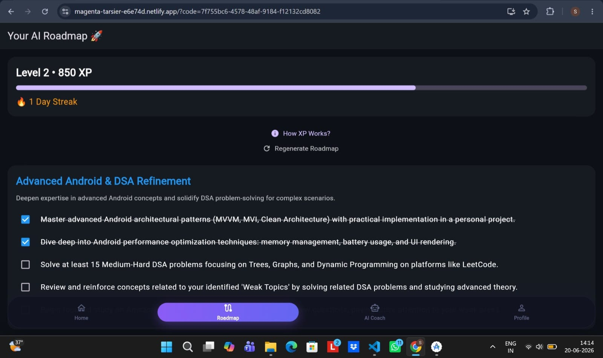</td>
    <td>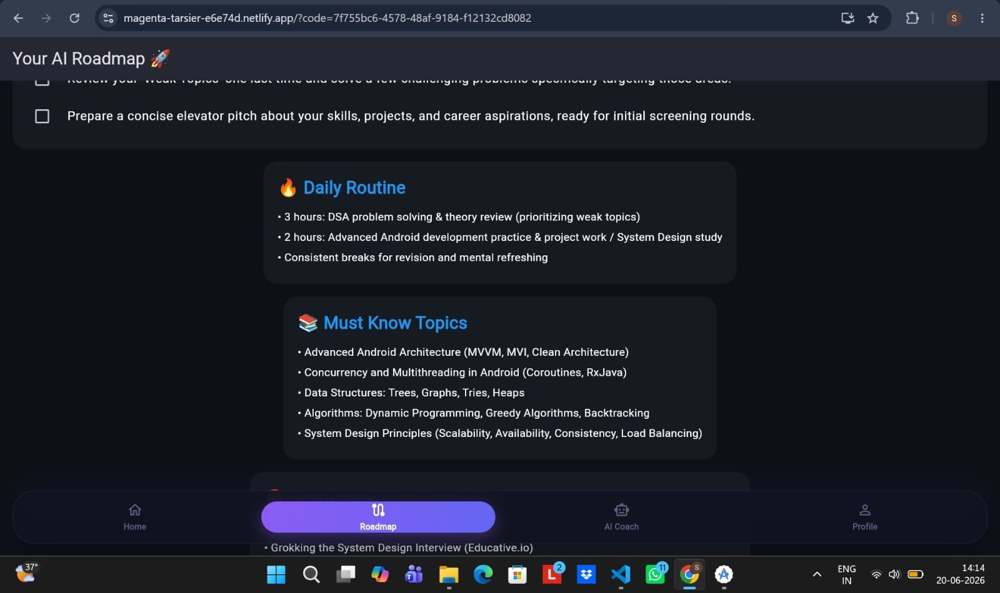</td>
  </tr>
</table>

## ✨ Features

### 🤖 AI Career Coach — "Nova"
Chat with Nova, your AI mentor, for:
- Career advice
- Placement strategy
- Doubt-solving and motivation

### 📊 Real Profile Tracking
Pulls live data from your actual coding profiles:
- **GitHub** — repos, languages, stars
- **LeetCode** — problems solved, difficulty breakdown, topic strengths
- **GeeksforGeeks** — coding score, streaks, problem stats

### 🗺️ Personalized Roadmap
AI-generated 30-60-90 day placement preparation plan based on:
- Your weak/strong topics
- Dream company
- Daily study hours
- Branch and year

### 🔐 Authentication
Secure auth powered by Supabase, including:
- Email/password login
- Google Sign-In
- Persistent sessions

### 🎨 Modern UI
- Dark-themed, gradient-driven design
- Smooth animations
- Responsive across Android and Web

## 🛠️ Tech Stack

**Frontend**
- Flutter
- Dart

**Backend**
- FastAPI (Python)
- Google Gemini AI
- Hosted on Render

**Database & Auth**
- Supabase (PostgreSQL + Auth)

**Hosting**
- Netlify (Web)
- Render (Backend API)

## 🏗️ Architecture

```
UI Layer (Flutter Widgets)
        │
        ▼
  AIService / AuthService
        │
        ▼
   FastAPI Backend ──────► Google Gemini AI
        │
        ▼
  GitHub / LeetCode / GFG APIs

Supabase handles:
  - Authentication
  - User Profiles
  - Session Management
```

## 🚀 Getting Started

**Clone Repository**
```bash
git clone https://github.com/Salonniii/nexora-app.git
```

**Install dependencies**
```bash
flutter pub get
```

**Configure Supabase**
Add your Supabase URL and anon key in:
```
lib/core/constants/supabase_constants.dart
```

**Run Application**
```bash
flutter run
```

## 📁 Project Structure

```
nexora-app
│
├── lib
│   ├── core
│   ├── features
│   │   ├── auth
│   │   ├── dashboard
│   │   ├── profile
│   │   ├── roadmap
│   │   ├── onboarding
│   │   ├── navigation
│   │   └── splash
│   ├── models
│   └── services
│
├── screenshots
│
└── README.md
```

## 🔮 Future Improvements
- Push notifications for daily reminders
- LinkedIn profile insights
- Mock interview AI simulator
- Resume analyzer
- iOS support

## 👩‍💻 Developer
**Saloni Gupta**
Computer Science Student | Flutter Developer | AI Enthusiast

- GitHub: [github.com/Salonniii](https://github.com/Salonniii)
- LinkedIn: [linkedin.com/in/saloni-gupta-7840a92b9](https://www.linkedin.com/in/saloni-gupta-7840a92b9)

## ⭐ Support
If you found this project useful, consider giving it a ⭐ on GitHub.
Your support motivates future improvements and new features.

---
Made with ❤️ using Flutter, Supabase, FastAPI & Google Gemini AI.
